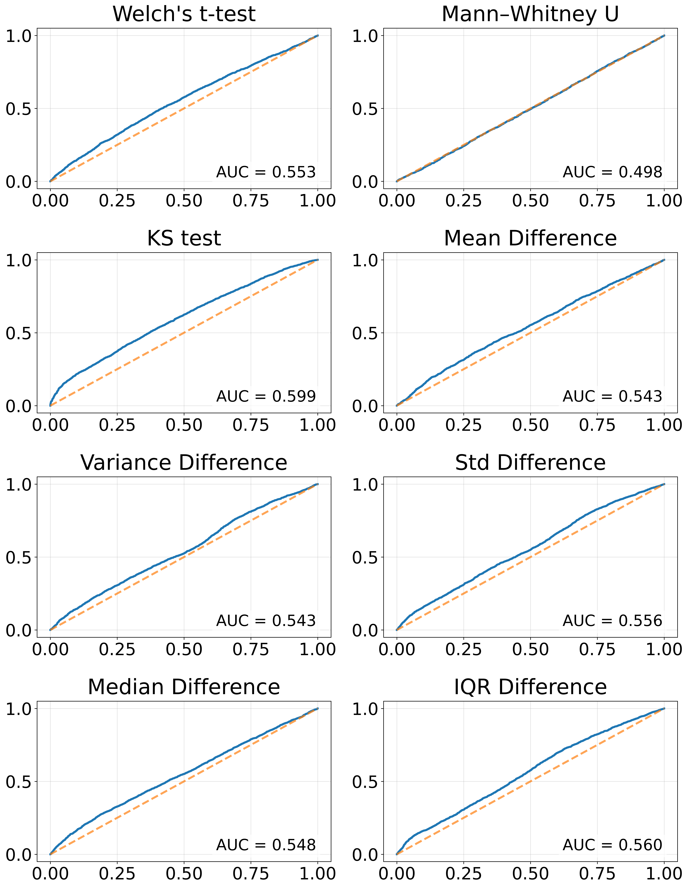
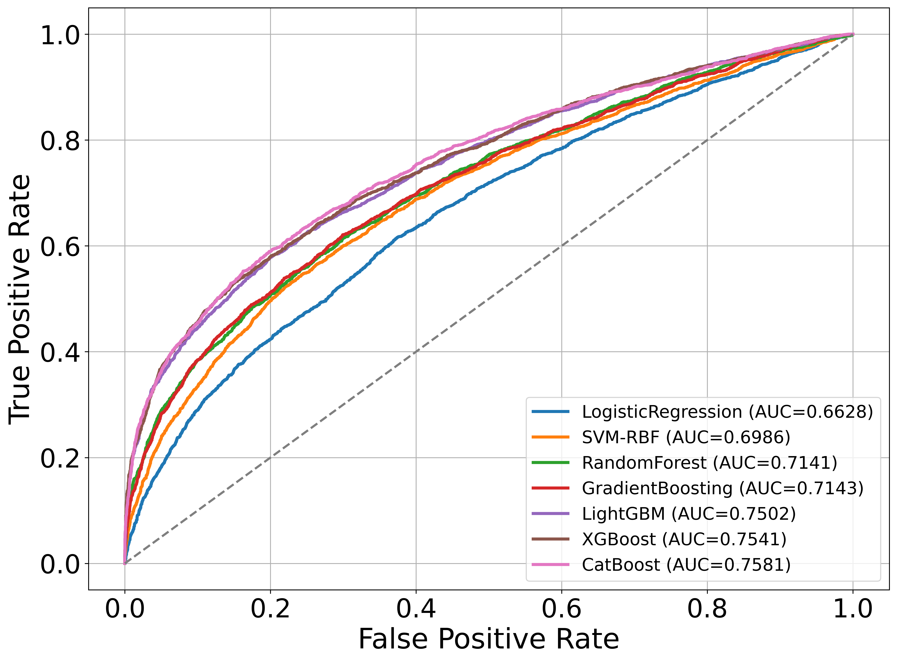
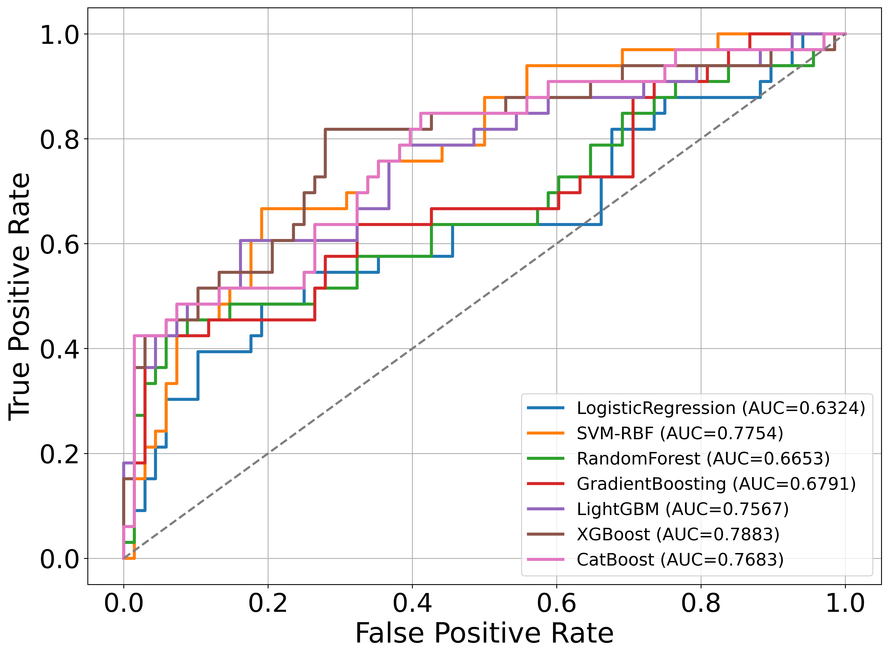
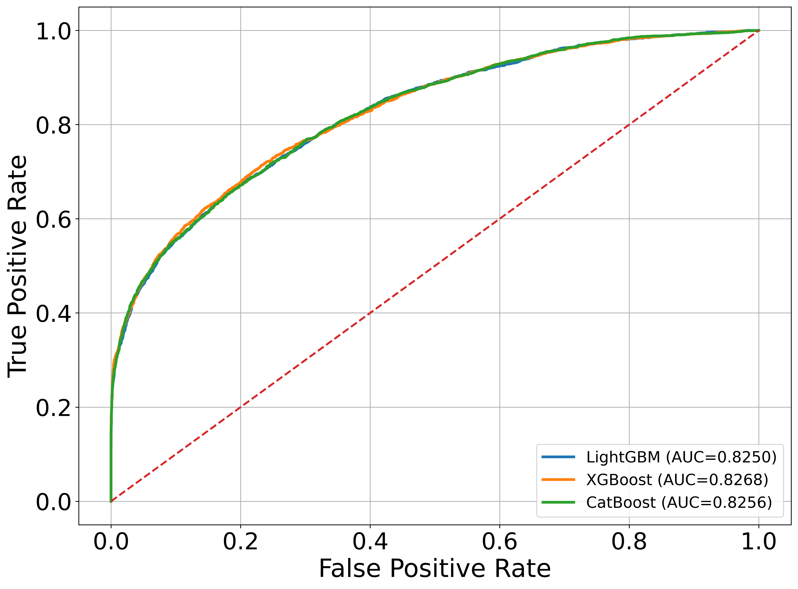
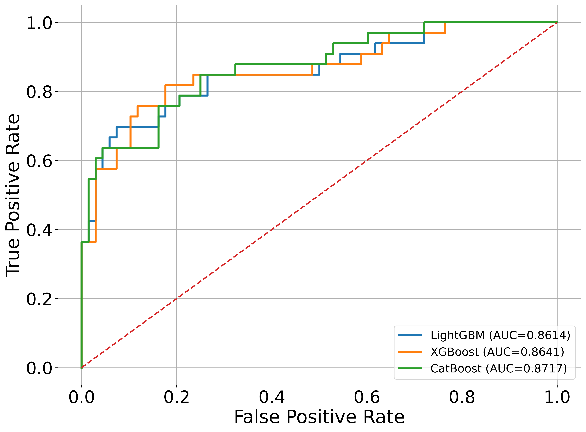
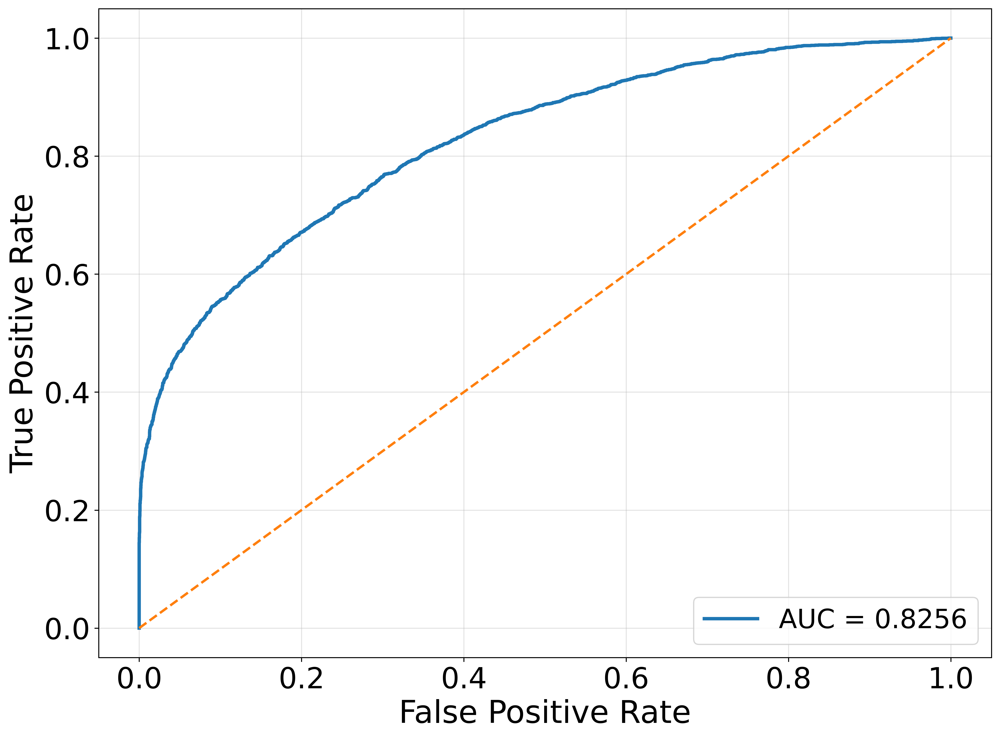
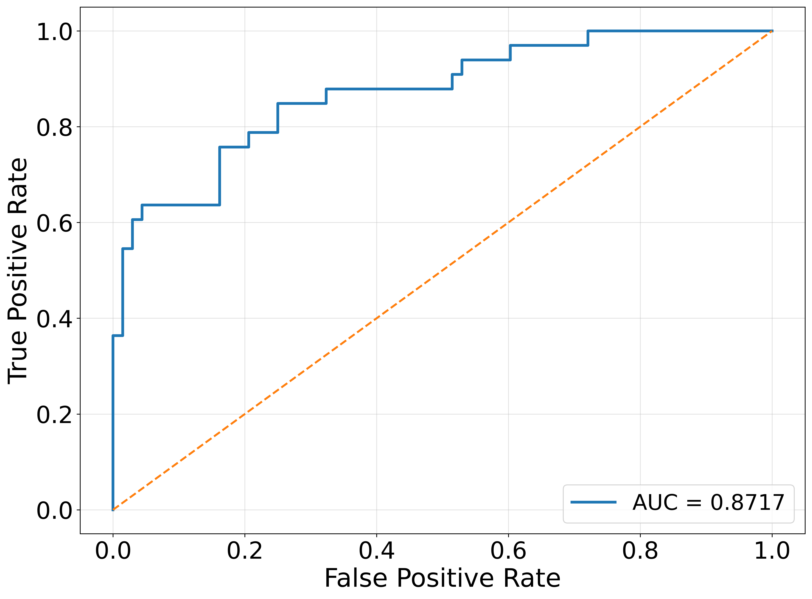
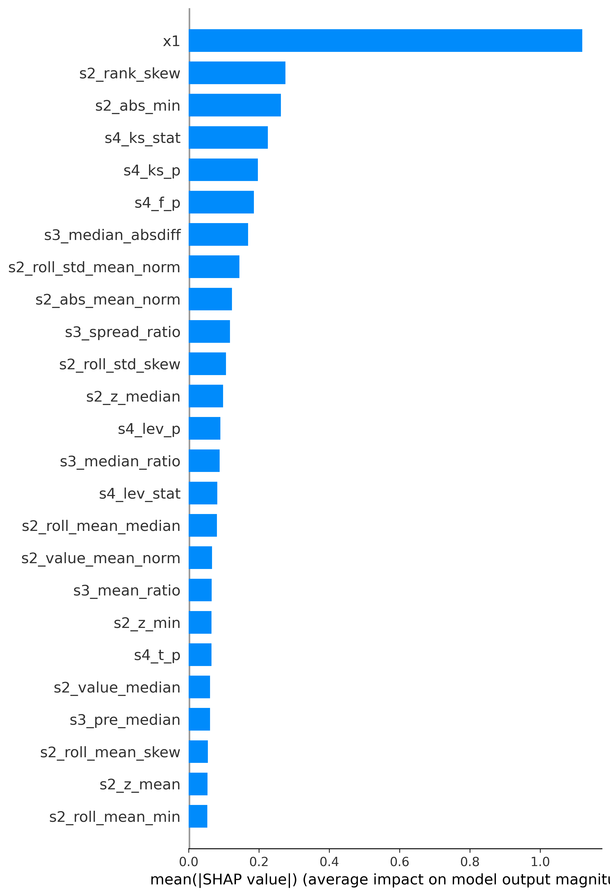
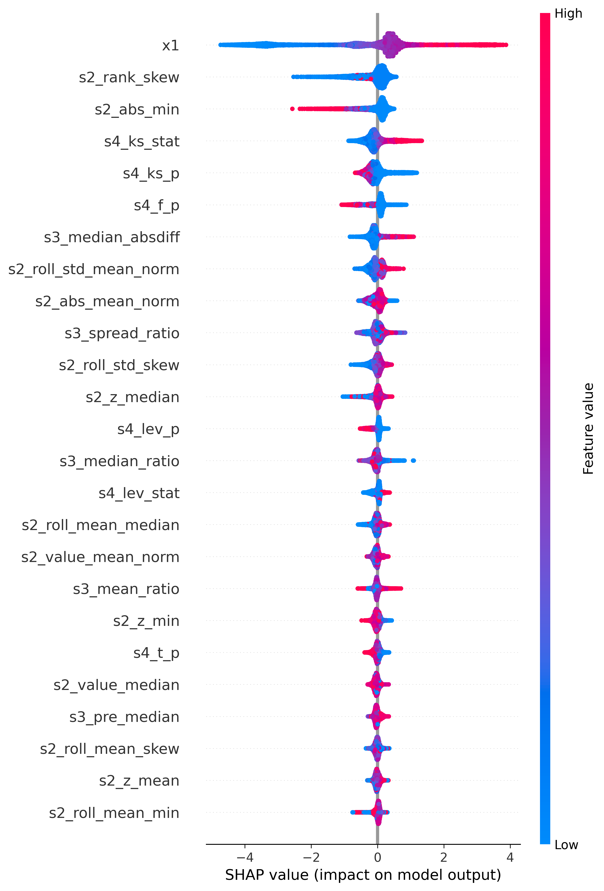
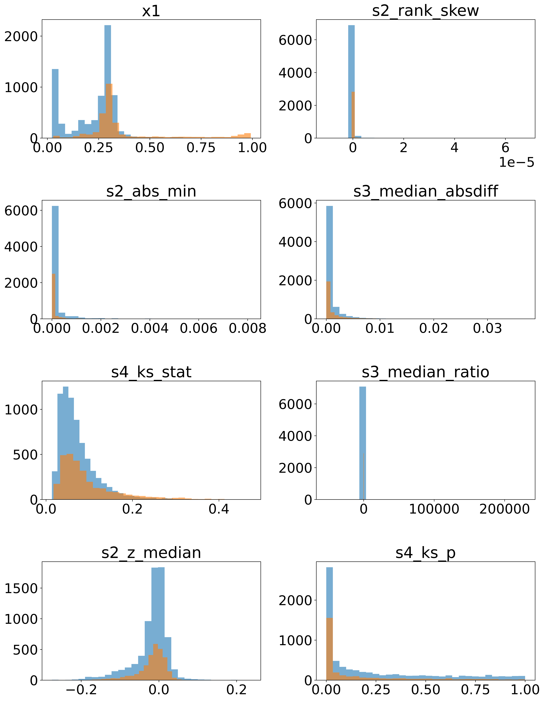

# ADIA Lab Structural Break Open Benchmark Challenge

---

## Problem Description

This project is based on the **ADIA Lab Structural Break Open Benchmark Challenge**, a public machine learning competition hosted by CrunchDAO:  
https://hub.crunchdao.com/competitions/structural-break-open-benchmark

The goal of the competition is to determine whether a **structural break** occurs at a *known boundary point* in a univariate time series.

A structural break refers to a change in the underlying data-generating process, such as a shift in mean, variance, volatility, or temporal dependence.  
These breaks are common in economic and financial time series and can significantly affect statistical inference, forecasting accuracy, and downstream decision-making.

---

### Task Definition

Each data sample consists of a **single univariate time series** that is explicitly divided into two consecutive segments:

- A **pre-boundary segment**
- A **post-boundary segment**

The boundary location is *known in advance* and is the same across all samples.

The task is **not** to locate the breakpoint, but to answer a binary question:

> **Do the statistical properties of the time series change at the given boundary point in a way that is consistent with a structural break?**

In other words, the problem asks whether the two segments originate from the same data-generating process or from different ones.

---

### Input and Output

For each time series:

- The input consists of a sequence of observations along with a binary indicator specifying whether each observation occurs before or after the boundary.
- The output is a single binary label:
  - **True**: a structural break occurs at the boundary  
  - **False**: no structural break occurs  

The task can therefore be formulated as a **binary classification problem at the time-series level**.

---

### Key Constraints

The competition imposes several important constraints:

- **Deterministic inference**: Models must produce identical predictions when evaluated multiple times on the same data.
- **Computational efficiency**: Inference must be fast enough to scale to tens of thousands of time series.
- **Generalization**: Performance is evaluated on held-out test sets generated from potentially different data distributions.

These constraints encourage solutions that are robust, interpretable, and suitable for real-world deployment rather than overly complex or stochastic models.

---

### Dependencies

The implementation relies on a standard Python scientific computing stack for time-series feature engineering, statistical testing, machine learning, and model interpretability.

#### Core Scientific Computing

- numpy: numerical array operations and low-level mathematical computations.
- pandas: long-format time-series manipulation, grouping by id, and feature aggregation.

#### Visualization

- matplotlib: generation of time-series plots, ROC curves, and report-quality figures.

#### Statistical Analysis

- scipy: classical statistical hypothesis tests for comparing pre-boundary and post-boundary segments.

#### Machine Learning Framework

- scikit-learn: model pipelines, preprocessing, cross-validation, and performance evaluation.

#### Gradient Boosting Models

- lightgbm: tree-based gradient boosting models for efficient and high-performance classification.
- xgboost: alternative gradient boosting implementation used when available.
- catboost: gradient boosting model with strong robustness and minimal feature preprocessing.

#### Pre-trained Tabular Model

- tabpfn: pre-trained transformer-based tabular model used as a deterministic base learner.

#### Model Persistence and Utilities

- joblib: serialization and deserialization of trained models and pipelines.

#### Model Interpretability

- shap: feature attribution and interpretability analysis for the final models.

---

## Dataset Description

The dataset consists of a large collection of synthetic univariate time series designed for structural break detection.  
Each time series contains a predefined boundary point at which a structural break may or may not occur.

The training set includes 10,000 time series, with an additional 10,000 series for both the public and private test sets.  
For local evaluation, a smaller test set of 100 time series is provided.  
Each series contains approximately 1,000–5,000 observations.

The input data are stored as a pandas.DataFrame with a MultiIndex structure (id, time), and include the following columns:

- **value**: observed time series values  
- **period**: binary indicator (0 = pre-boundary, 1 = post-boundary)  

The target variable `y` is a boolean pandas.Series indexed by id.

Models must be computationally efficient and deterministic.  
A determinism check re-runs inference on 30% of the test data, requiring identical outputs within a tolerance of 1e−8.

---

## Visualization of a True Structural Break

**Method.**  
The `plot_true_breakpoint_transformations` function visualizes a single time series with a known positive structural break (target_id = 10000).  
The same series is transformed using multiple deterministic transformations to expose changes in distributional and temporal characteristics:

- Original series  
- Z-score normalization  
- Cumulative sum  
- Rank and dense-rank transforms  
- Rolling mean  
- Rolling standard deviation  

  

Figure: Original time series and transformed representations for a sample with a ground-truth positive structural break (True). The red dashed line marks the known boundary provided by the dataset.

**Interpretation.**  
The vertical dashed line indicates the predefined boundary point.  
While the raw series shows ambiguous visual evidence of a break, several transformed views amplify contrasts in level, variance, and volatility between pre- and post-boundary segments, making the structural break more apparent.

---

## Evaluation of Classical Statistical Tests

**Method.**  
The `plot_8_tests_train_roc_4x2` function evaluates eight classical statistical tests on the training set.  
Each test is applied to pre- and post-boundary segments, and its test statistic or p-value is used as a decision score to construct ROC curves.

The evaluated tests are:

- T-Test  
- Mann–Whitney U Test  
- Levene’s Test  
- Kolmogorov–Smirnov Test  
- Variance Ratio Test  
- CUSUM Test  
- Autocorrelation Test  
- Runs Test  

  

Figure: ROC curves of individual statistical tests evaluated on the training set.

**Interpretation.**  
Each subplot shows the ROC curve of a single statistical test.  
Most tests achieve only modest AUC values, indicating limited discriminative power when used in isolation for structural break detection.

---

## Baseline Machine Learning Model Comparison

**Method.**  
The `run_compare_models_train_oof_and_test` pipeline performs a comprehensive comparison of baseline machine learning models.  
The procedure includes:

1. Feature engineering using summary statistics, distributional metrics, statistical test p-values, and pre/post difference features  
2. Ten-fold stratified cross-validation to generate Out-of-Fold (OOF) predictions  
3. Training multiple classifiers: Logistic Regression, Decision Tree, Random Forest, Extra Trees, XGBoost, LightGBM, and CatBoost  
4. ROC-based performance visualization on both training (OOF) and test sets  

  

Figure: Strict OOF ROC curves of different models on the training set.

  

Figure: ROC curves evaluated on the independent test set.

**Interpretation.**  
The OOF ROC curves provide an unbiased estimate of training performance, while the test ROC curves assess generalization.  
Tree-based ensemble models consistently outperform linear and single-tree baselines.

---

## Stacking-Based Meta-Learning Ensemble

**Method.**  
A stacking strategy is implemented to combine multiple boosting models at the meta level.  
Out-of-Fold predictions from base learners are used to train three gradient boosting meta models.

  

Figure: Strict OOF ROC curves for TabPFN-augmented boosting models.

  

Figure: ROC curves of the final stacked model on the test set.

**Interpretation.**  
The meta models exhibit improved and more stable ROC performance compared with individual base models, particularly on the test set.

---

## Final Two-Stage TabPFN + Boosting Model

**Method.**  
The `run_tabpfn_x1_plus_s234_three_models` pipeline implements a two-stage architecture:

**Stage 1 – TabPFN Base Model**

- Transformer-based model pre-trained on synthetic tabular datasets  
- Performs in-context learning without gradient updates  
- Generates probabilistic predictions from statistical features (X1)  

**Stage 2 – Gradient Boosting Meta Models**

- Original statistical features (X1)  
- TabPFN prediction probabilities as meta-features (S2, S3, S4)  
- Meta learners: XGBoost, LightGBM, and CatBoost  

  

Figure: ROC curve of the final stacked model on the training set (AUC ≈ 0.8256).

  

Figure: ROC curve of the final stacked model on the independent test set (AUC ≈ 0.8718).

**Interpretation.**  
The stacked TabPFN + CatBoost model achieves strong discrimination under strict cross-validation and maintains robust performance on the test set.

---

## Model Interpretability and Feature Analysis

**Method.**  
To further interpret the final stacked model, feature importance and SHAP-based analyses are conducted on the CatBoost meta model.  
These analyses aim to quantify the contribution of each engineered feature and to examine how feature values influence model predictions at both global and sample levels.

---

### Global SHAP Feature Importance

  

Figure: Global SHAP feature importance measured by mean absolute SHAP values.

**Interpretation.**  
This bar plot presents global feature importance measured by mean absolute SHAP values.  
Unlike model-specific importance scores, SHAP values provide a model-agnostic attribution of each feature’s average impact on the prediction magnitude.

Consistent with CatBoost importance, TabPFN-derived probabilities rank among the most influential features.  
In addition, several structural contrast features related to distributional shifts before and after the boundary also show substantial contributions, confirming that the final model leverages both learned and handcrafted signals.

---

### SHAP Beeswarm Plot

  

Figure: SHAP beeswarm plot illustrating feature-level contributions across samples.

**Interpretation.**  
The SHAP beeswarm plot visualizes the distribution of SHAP values for individual samples across the most important features.  
Each point corresponds to one sample, with color indicating the feature value and horizontal position indicating the direction and magnitude of its contribution.

For high-ranking features, clear and consistent directional patterns can be observed, suggesting stable feature effects across samples.  
This indicates that the model does not rely on spurious interactions but instead captures systematic relationships associated with structural breaks.

---

### Distribution of Top Features

  

Figure: Distributions of the top eight SHAP-ranked features.

**Interpretation.**  
This figure displays the empirical distributions of the top eight most important features, arranged in a 4×2 grid.  
Each subplot corresponds to a single feature and compares its distribution across time series with and without structural breaks.

Several features exhibit clear separation or shifted distributions between the two classes, providing direct evidence that these features encode genuine structural differences in the data rather than model-induced artifacts.  
This further validates the effectiveness of the feature engineering strategy prior to modeling.

## Acknowledgment

Part of the modeling ideas and implementation details were inspired by the open-source solution shared by **aParsecFromFuture**.  
We gratefully acknowledge the author for contributing to the community.

Repository link:  
https://github.com/aParsecFromFuture/ADIA-Lab-Structural-Break-Challenge-Solution

